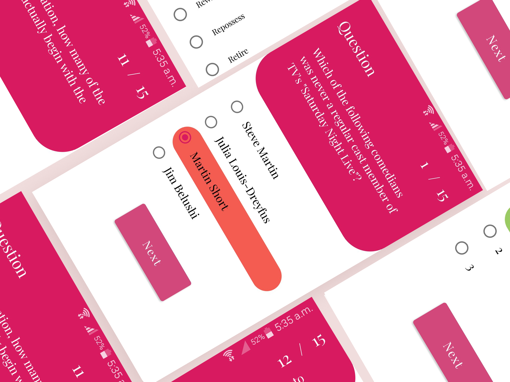
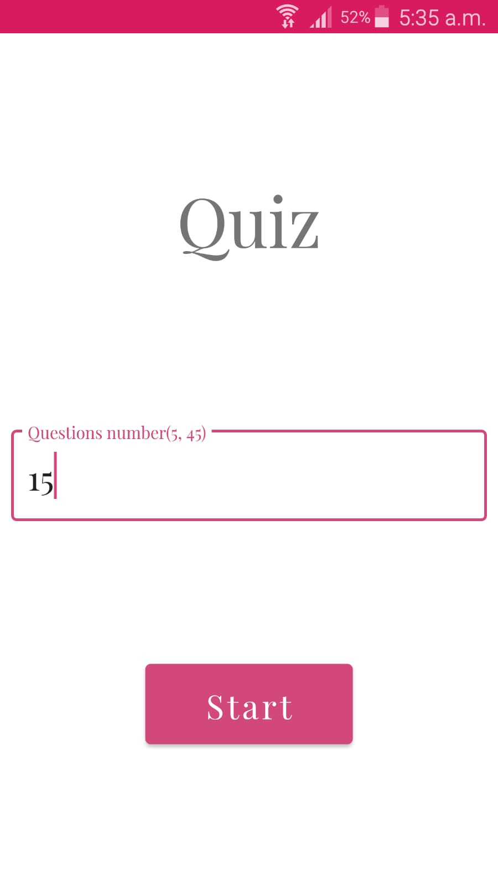
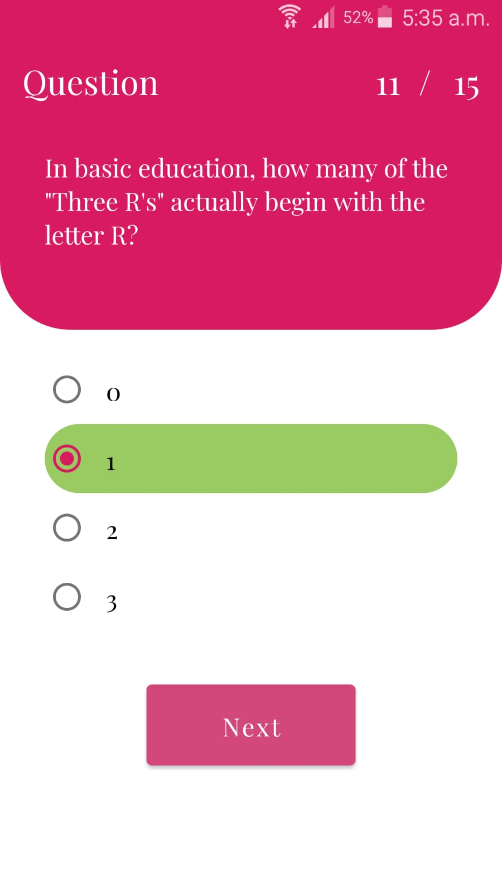
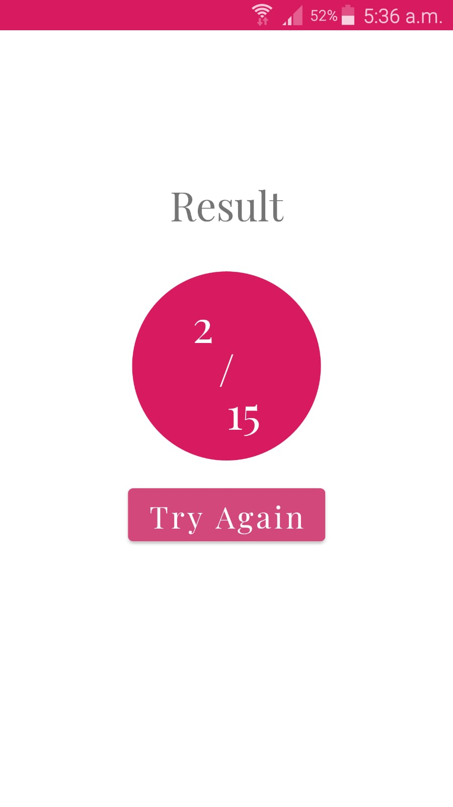

# Quiz App

Multiple-choice questions app with animations that make it look like a game.

## Installation
Clone this repository and import into **Android Studio**
```bash
git clone https://github.com/MohammedOH/Quiz_App.git
```
## App UI


<div>
  
  
  
  
  
</div>

## Generating signed APK
From Android Studio:
1. ***Build*** menu
2. ***Generate Signed APK...***
3. Fill in the keystore information *(you only need to do this once manually and then let Android Studio remember it)*


## Contributing
1. Fork it.
2. Create your feature branch (git checkout -b my-new-feature).
3. Commit your changes (git commit -m 'Add some feature').
4. Push your branch (git push origin my-new-feature).
5. Create a new Pull Request.
